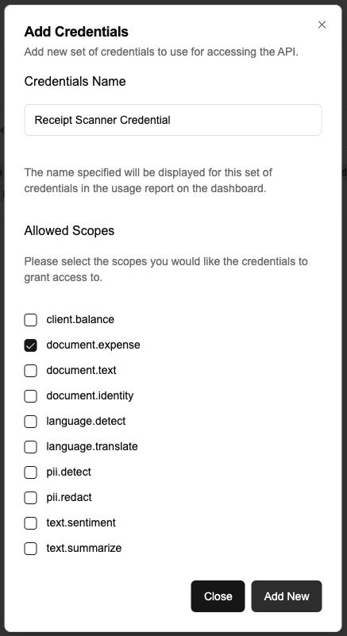

# Cross platform mobile app for scanning receipts

[](https://www.youtube.com/shorts/YCWbHdAUdg8)

## Tools used

- Flutter https://flutter.dev/
- Supabase edge functions https://supabase.com/docs/guides/functions
- Intelligent API https://intelligent-api.com/

## Possible use cases

This sample code could be used to build applications such as:

- Expense tracking app
- Bill splitting app

## Overview

This sample code shows how you could use the Intelligent API's Document Expense endpoint (https://docs.intelligent-api.com/api#document-ocr-extract-expenses-extractexpenses) combined with Flutter and Supabase Edge Functions to create a cross platform Receipt Scanning application.

Flutter is used as the framework to allow us to target both iOS and Android devices, and we use Supabase Edge Functions to create a simple authentication service (that would be extended upon in a production scenario with user authentication) for the Intelligent API.

This mechanism of using the Supabase Edge Function means we can safely deploy our application to app stores without it containing any secrets and us being able to prevent malicious users from using our Intelligent API credentials without our knowledge.

## Getting started

This getting started guide shows you how to create your own version of this application. If you just want to use this code as is, please pull the repository and follow the guide as is but instead of copying the code where indicated you simply need to ensure you replace the relevant settings once you have setup your own versions of them (i.e. Intelligent API Credentials, Supabase Settings).

### Intelligent API

Follow the Intelligent API Getting Started guide https://docs.intelligent-api.com/docs/gettingstarted to create an account and then create a specific OAuth Credential with only the `document.expense` scope specified.

> Be sure to store the `Client Id` and `Client Secret` securely, we will be adding that to Supabase later.



### Supabase Edge Function

Next sign up for Supabase (https://supabase.com/dashboard/sign-up) and create a project. Now you need to create the secrets for the Intelligent API credentials and save them in Supabase, so navigate to the project you created, select `Edge Functions` and then `Secrets`. Next add the following secrets:

| Secret Name   | Secret Value                                                                                                 |
| ------------- | ------------------------------------------------------------------------------------------------------------ |
| CLIENT_ID     | [The Intelligent API `Client Id` you received when you created your OAuth Credential in Intelligent API]     |
| CLIENT_SECRET | [The Intelligent API `Client Secret` you received when you created your OAuth Credential in Intelligent API] |

Once you are done, you must install the Supabase CLI (https://supabase.com/docs/guides/local-development/cli/getting-started) on your computer and then login. We used `homebrew` so we did this:

```shell
brew install supabase/tap/supabase
supabase login
```

Once we were logged in we could create our function:

```shell
supabase functions new receipt-scanner
```

This command would have created a folder called `supabase`, with a sub-folder called `functions` and a sub-folder in that called `receipt-scanner` with a sample hello world function. We can then copy the code from this repository file `supabase/functions/receipt-scanner/index.ts` and replace your `index.ts` file with it. Then deploy the project (be sure to replace [SUPABASE_PROJECT_ID] with your relevant supabase project id below):

```shell
supabase functions deploy receipt-scanner --project-ref [SUPABASE_PROJECT_ID]
```

### Flutter Project

Next we created a simple flutter project via the CLI using:

```shell
# At the minimum please update the --org argument
flutter create receipt_scanner --project-name receipt_scanner --org com.intelligentApi --platforms ios,android -t app -e
```

Ensure your `pubspec.yaml` has the required dependencies:

```yaml
dependencies:
  camera: ^0.11.1
  flutter:
    sdk: flutter
  http: ^1.3.0
  permission_handler: ^11.4.0
  supabase_flutter: ^2.8.4
```

Make sure your download the required dependencies:

```shell
flutter pub get
```

To get started quickly, you can simply copy the all the files from the `lib` folder into your `lib` folder, however there are special items you will have to update for camera access:

- Add the `<uses-permission android:name="android.permission.CAMERA"/>` entry to the `android/app/src/main/AndroidManifest.xml` file.
- Add the following entries to your `ios/Runner/Info.plist` file:

```xml
	<key>NSPhotoLibraryUsageDescription</key>
	<string>App needs access to photo lib for selecting images</string>
	<key>NSCameraUsageDescription</key>
	<string>We need access to your camera to scan receipts</string>
```

- Add the following entry to your `ios/Podfile`:

```
    # To allow camera access you must add this section to your Podfile
    target.build_configurations.each do |config|
      config.build_settings['GCC_PREPROCESSOR_DEFINITIONS'] ||= [
          '$(inherited)',

          ## dart: PermissionGroup.camera
          'PERMISSION_CAMERA=1',

          ## dart: PermissionGroup.photos
          'PERMISSION_PHOTOS=1',

          ## dart: PermissionGroup.mediaLibrary
          'PERMISSION_MEDIA_LIBRARY=1',
        ]
    end
```

Next you need to setup your environment variables, you can use this guide as an example: https://www.sandromaglione.com/articles/how-to-use-environmental-variables-in-flutter

We used VS Code to build our application, so to add our environment variables we:

- Created a `.vscode` folder in the root of our project
- Create a `launch.json` file in that folder with the relevant code (please replace the relevant values below with your SUPABASE_PROJECT_ID and SUPABASE_ANON_KEY):

```json
{
  "configurations": [
    {
      "name": "Dart",
      "type": "dart",
      "request": "launch",
      "program": "lib/main.dart",
      "args": [
        "--dart-define=SUPABASE_URL=https://[SUPABASE_PROJECT_ID].supabase.co",
        "--dart-define=SUPABASE_ANON_KEY=[SUPABASE_ANON_KEY]",
        "--dart-define=API_ENDPOINT=https://api.intelligent-api.com/v1/document/expenses"
      ]
    }
  ]
}
```

## Run the app

You should now be able to run your application. On initial load when you click `Scan Receipt` you should get a permission request to use the camera, but subsequent runs should not ask that again.
